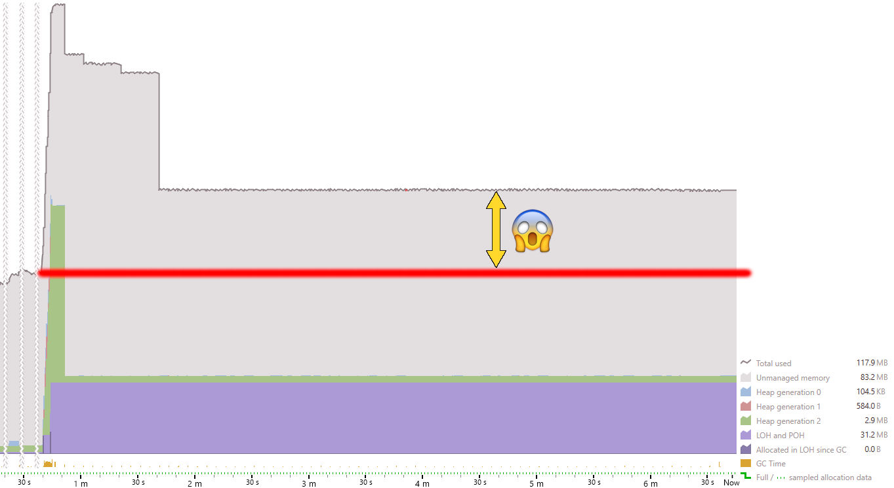
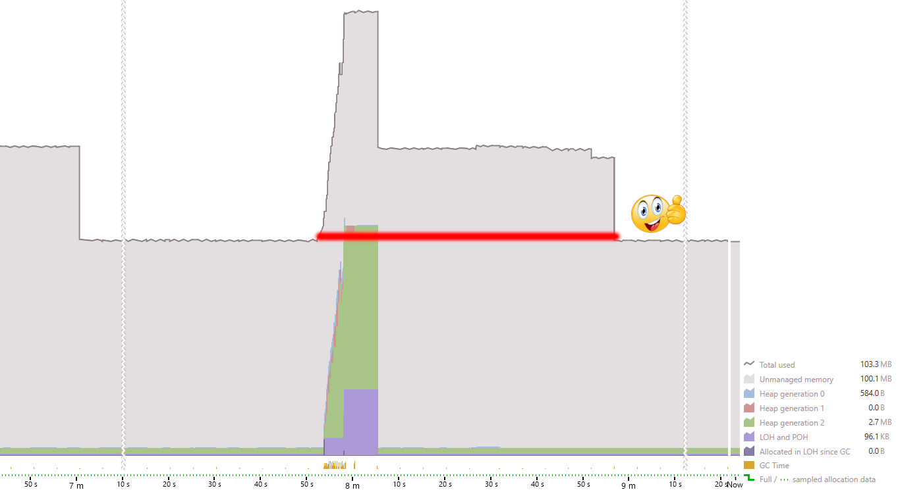

# MAUI Memory Leaks

This repo aims to be self-explanatory from within the application.
Please clone, build, and run. 

The screenshots originate in JetBrains' dotMemory tool.
 

The individual cases try to illustrate situations when the memory is not being freed up,  

   
Accompanied by solutions / workarounds showing the memory got reclaimed.  

